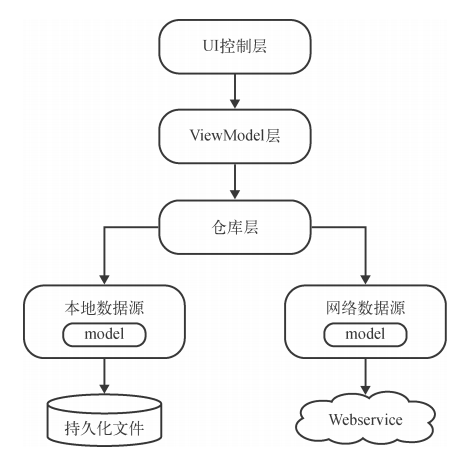

# SunnyWeather
> 根据《第一行代码-Android》第三版实现天气App  
## 架构 MVVM
MVVM（Model- View-ViewModel ）是一种高级项目架构模式，目前已被广泛应用在Andr oid程序设计领域，类似的架构模式还有MVP、MVC等。
简单来讲，MVVM架构可以将程序结构主要分成3部分：Model 是数据模型部分；View 是界面展示部分；而ViewModel 比较特殊，可以将它理解成一个连接数据模型和界面展示的桥梁，从而实现让业务逻辑和界面展示分离的程序结构设计。

- UI控制层：包含了Activity 、Fragment 、布局文件等与界面相关的东西。
- ViewModel 层用于持有和UI元素相关的数据，以保证这些数据在屏旋转时不会丢失，并且还要提供接口给UI控制层调用以及和仓库层进行通信。 
- 仓库层要做的主要工作是判断调用方请求的数据应该是从本地数据源中获取还是从网络数据源中获取，并将获取到的数据返回给调用方。
- 本地数据源可以使用数据库、SharedPreferences等持久化技术来实现，而网络数据源则通常使用Retrofit访问服务器提供的Webservice接口来实现。
图中所有的箭头都是单向的，比方说UI控制层指向了ViewModel层，表示UI控制层会持有ViewModel层的引用，但是反过来ViewModel层却不能持有UI控制层的引用，其他几层也是一样的道理。除此之外，引用也不能跨层持有，比如UI控制层不能持有仓库层的引用，谨记每一层的组件都只能与它相邻层的组件进行交互。
## 目录
